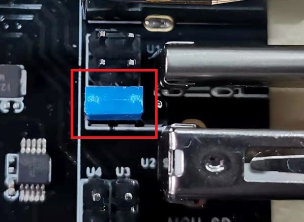
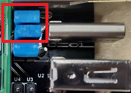

# Bootloader

Bootloader is the boot program, which is a code placed at the beginning of the flash space of the motherboard storage. The main function is to make the motherboard have the function to flash firmware with sdcard. We provide two methods to upload the bootloader.

## Method 1 : stm32cubeprogrammer

This method only works in windows.

### Step 1: Download stm32cubeprogrammer 


You can download it from ST website.

https://www.st.com/zh/development-tools/stm32cubeprog.html

Open the STM32CubeProgrammer software.


### Step 2: Enter DFU mode


1. First power off the board
2. Set jumper for 5v  
3. Set jumper on BT0 to 3.3V pin 
4. Make sure no jumpers on USB connection pins 
5. Connect board TypeC USB port and your computer with USB cable
5. Power up the board with 24v 

Now the board is in DFU mode. If not, try to click the mcu reset button `mcuRST`. 

***REMEMBER to remove BT0 jumper if you finish uploading bootloader or it will enter DFU mode again.***

### Step 3: Upload the bootloader


Now you can connect and flash the Spider board with STM32CubeProgrammer with the following operation.


Do as the red number shows in the screen shot.

1. Click the button to find the DFU port.
2. Connect the DFU 
3. Choose the downloaded `Bootloader.hex` file. 
4. Start Programming

## Method 2: dfu-util 

This method works in linux, that means should work in raspberry pi. ***According to community members feedbacks, someone runs into klipper no connection with 3DPi. If you are in this situration, please use method 1 instead.***

### Step 1: Set jumpers and connect


1. First power off the board
2. Set jumper for 5v  
3. Set jumper on RaspberryPi  USB connection pins 
5. Power up the board with 24v 

### Step 2: Install stm32flash

1. Check if stm32flash is installed by `stm32flash -h`, it will shows like

   ```
   Usage: stm32flash [-bvngfhc] [-[rw] filename] [tty_device | i2c_device]
           -a bus_address  Bus address (e.g. for I2C port)
           -b rate         Baud rate (default 57600)
           -m mode         Serial port mode (default 8e1)
           -r filename     Read flash to file (or - stdout)
           -w filename     Write flash from file (or - stdout)
           -C              Compute CRC of flash content
           -u              Disable the flash write-protection
           -j              Enable the flash read-protection
           -k              Disable the flash read-protection
           -o              Erase only
           -e n            Only erase n pages before writing the flash
           -v              Verify writes
           -n count        Retry failed writes up to count times (default 10)
           -g address      Start execution at specified address (0 = flash start)
           -S address[:length]     Specify start address and optionally length for
                                   read/write/erase operations
           -F RX_length[:TX_length]  Specify the max length of RX and TX frame
           -s start_page   Flash at specified page (0 = flash start)
           -f              Force binary parser
           -h              Show this help
           -c              Resume the connection (don't send initial INIT)
                           *Baud rate must be kept the same as the first init*
                           This is useful if the reset fails
           -R              Reset device at exit.
           -i GPIO_string  GPIO sequence to enter/exit bootloader mode
                           GPIO_string=[entry_seq][:[exit_seq]]
                           sequence=[[-]signal]&|,[sequence]
   ```

   If not , you should install it first, you can get it [here](https://sourceforge.net/projects/stm32flash/). Or use the package manager of your distribution to get the latest version, like

   ```
   sudo apt-get install stm32flash
   ```

### Step 3: Upload the bootloader

Enter the folder which contains `bootloader.bin` file using `cd` command, then shoot  

```
stm32flash -R -w bootloader.bin -S 0x08000000 -v -i rts,,-dtr,,dtr, /dev/ttyUSB0
```

**Note: if you failed once, try again or click the mcuRST button and try again**
