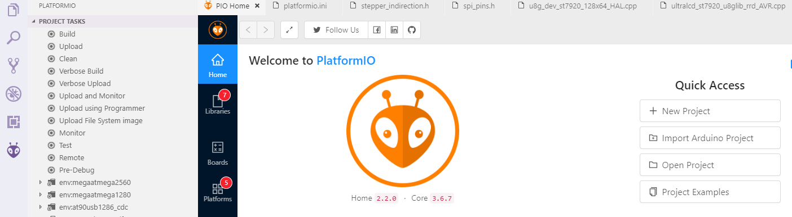
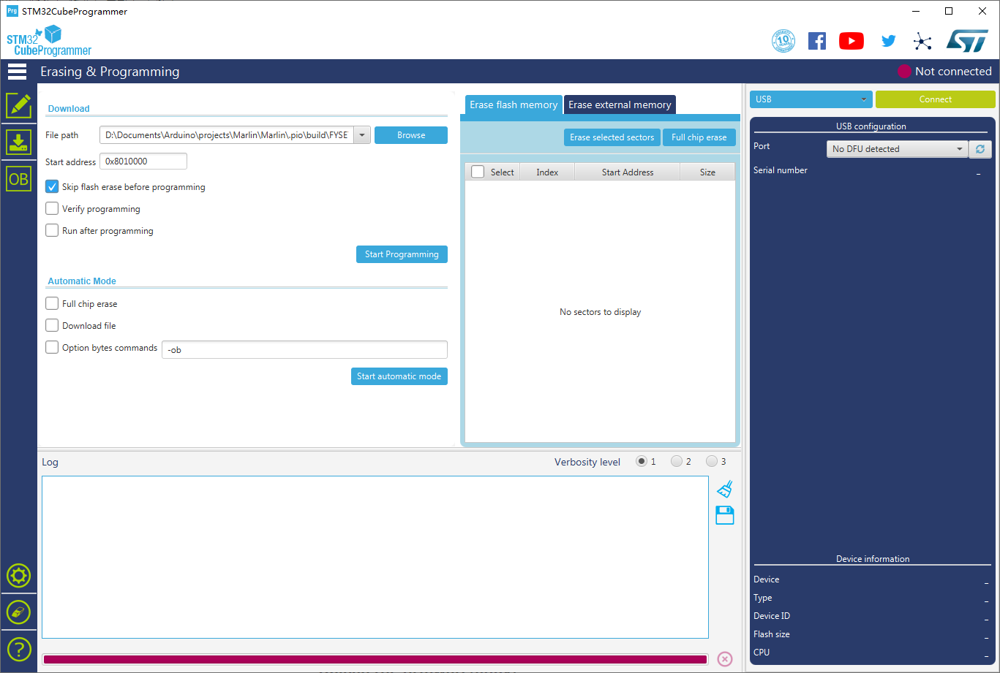

# Firmware&OS Guide

As we offer you two core board options on Cheetah Mix, so there are 3 combinations of firmware and OS.

1. RaspiberryPi CM4(OctoPi OS) + MCU(Marlin)
2. RaspiberryPi CM4(OctoPi OS with Klipper) + MCU(Klipper)
3. M10 core(KlipperWrt OS) + MCU(Klipper)

We provide you OctoPi image in this folder, check the `README.md` file there.

## 1.1 OS Guide

### 1.1.1 RaspiberryPi OS

We can run several OS on RaspberryPi, but i recommend to start from [OctoPi](https://github.com/guysoft/OctoPi) OS first as it already integrated several softwares and Optimize the system for our use case. You can try our provided OS `OctoPi-octodash.img` in this folder or use OctoPi v0.18.0 or later - see the [OctoPi releases](https://github.com/guysoft/OctoPi/releases) for release information. 

##### Provided OctoPi

We provide you OctoPi OS, it is base on OctoPi v0.18.0 integrated Octodash and Klipper. 

You can login in Octoprint with the following account and password.

```
Account: FYSETC
Password: 12345678
```

OS SSH login account and password

```
Account: pi
Password: raspberry
```

Now, we can flash the OS to CM4.

#### 1.1.1.1 Flash RaspiberryPi OS

CM4 has two types, with or without eMMC.

##### No eMMC

If your CM4 don't have eMMC, follow the steps below to flash OS.

Step 1: Power off the board

Step 2: Install CM4 to Cheetah Mix

Step 3: Flash OS to micro-sd card

 You can follow the instruction here to flash downloaded OctoPi OS to your micro-sd card, then insert your micro-SD card to SYS_SD slot.


##### eMMC integrated

If your CM4 has eMMC then follow the steps below.

Step 1: Power off the board

Step 2: Install CM4 to Cheetah Mix

Step 3: Set Pi boot jumper


Step 4: Connect Cheetah Mix

Connect Cheetah Mix to your computer with micro-usb cable and power on Cheetah Mix.


Step 4: Flash OS to CM4 eMMC

Follow the instruction [here](https://www.raspberrypi.com/documentation/computers/compute-module.html#for-windows-users) on RaspberryPi website.

#### 1.1.1.2 Find IP address

If you flash Raspberrypi OS raspbian, you should refer to [this](https://www.raspberrypi.com/documentation/computers/remote-access.html#ip-address). 

If you use OctoPi OS, you can follow [here](https://community.octoprint.org/t/finding-the-pis-ip-address/844). 

If you use our OctoPi OS and your Cheetah Mix is runing our provided Marlin, you can send `M711` command from your computer to get IP address from Cheetah Mix TypeC USB port( need install serial tool on your computer). Remember to remove two jumpers below or it will connect to RaspberryPi CM4 but not your computer.

 

#### 1.1.1.3 Expand OS fs

If you use our provided OctoPi OS image, after you flash OS you need to expand the file system. Follow the instruction [here](https://piwithvic.com/raspberry-pi-expand-filesystem-micro-sd-card).

#### 1.1.1.4 Config Octoprint

Our OctoPi OS is pre-config for Marlin, if you want to run Klipper, you need to config Octoprint, follow the instruction [here](https://www.klipper3d.org/Installation.html#configuring-octoprint-to-use-klipper).

### 1.1.2 KlipperWrt

We can follow the steps below to install KlipperWrt

##### Step 1: Power off motherboard

##### Step 2: Install m10 core board to Cheetah Mix


##### Step 3: Insert an empty micro-sd card to `SYS_SD` slot

##### Step 4: Connect Cheetah Mix directly to your computer with network cable

##### Step 5: Download KlipperWrt from [here](https://github.com/ihrapsa/KlipperWrt).

##### Step 6: Prepare KlipperWrt firmware

Copy and rename KlipperWrt file `openwrt_snapshot_xxx-sysupgrade.bin` ( you can find it in `KlipperWrt\Firmware\OpenWrt_snapshot` folder) to `root_uImage.bin`.

##### Step 7: Enter m10 boot page

Set 5v jumper as below shows, then press and hold `m10RST` button and power on board with 24v


##### Step 8: Upload m10 firmware

Visit 192.168.1.1 web page. Click `选择文件` button  and choose `root_uImage.bin` and click `Firmware update` button to upload firmware to m10, wait for finish.

##### Step 9: Reboot

Power off and power on Cheetah Mix with 24v power supply.

Wait for your computer to recognize m10 network 

##### Step 10: Connect Cheetah Mix to Ethernet

According to our test, the best and most stable way to visit Cheetah Mix is using ethernet. Follow the steps below:

1. Visit `192.168.1.1:81`, go to Network->Interfaces
   
   Click the `Edit` button
   
   

2. Change the items as the below screen shot show
   
   Remember to click `switch protocal` button
   
   

3. Save -> Save & Apply -> Apply adn keep settings and wait for about 40 seconds for its parameter saving

4. Power off Cheetah Mix ,wait for power led off and power on it.

5. Connect your PC back to your router, and connect Cheetah Mix to your router with network cable. 

6. Find the devices IP address using your router admin page or a IP scanner tool like [Angry ip scanner](https://angryip.org/) (The host name is `OpenWrt` or `KlipperWrt`)

##### Step 11: Setup SSH connection

Install MobaXterm software and setup a SSH session to connect M10. Or just visit the `http://openwrt.local:81` or `http://m10-ip:81` you get from last step and go to `Services->Terminal` menu. 

##### Step 12: Install KlipperWrt

We have two options here. It is base on the KlipperWrt instruction [here](https://github.com/ihrapsa/KlipperWrt#automatic-steps).

###### Option 1: Installing Script method

Installs everything fresh and up to date. Possibly unstable, sometimes new dependencies are added and I might not have updated the script by then.  

<details>
  <summary>Click for STEPS!</summary>

This method uses 2 scripts to foramt an sd card and make it extroot and another one that installes everything from the internet.

- Download and execute the `1_format_extroot.sh` script:

> 

    cd ~
    wget https://github.com/ihrapsa/KlipperWrt/raw/main/scripts/1_format_extroot.sh
    chmod +x 1_format_extroot.sh
    ./1_format_extroot.sh

- You'll be prompted to reboot: type `reboot`

- Wait for m10 led stop flashing, power off. And power on again.

- Download and execute the `2_script_manual.sh` script:

> 

    cd ~
    wget https://github.com/ihrapsa/KlipperWrt/raw/main/scripts/2_script_manual.sh
    chmod +x 2_script_manual.sh
    ./2_script_manual.sh

- Follow the prompted instructions and wait for everything to be installed

- remove the scripts when done: `rm -rf /root/*.sh`

- Type `reboot` and wait for m10 led stop flashing, power off. And power on again.

- Use `http://openwrt.local` or `http://m10-ip`to access the Klipper client

- Done!

- Follow the Klipper guide next [here](#jumpk) to build Klipper.bin

- Go to [Flash firmware](#jumpf) step next.

</details>

###### Option 2: Cloning script method

<details>
  <summary>Click for STEPS!</summary>

This uses the preinstalled extroot filesystem archives [Releases](https://github.com/ihrapsa/KlipperWrt/releases/tag/v1.0).  
It comes preinstalled with **Mainsail** and **Klipper**, **Moonraker**, **mjpg-streamer** (for webcam stream) and Fry's **timelapse component** (for taking frames and rendering the video).

STEPS:

- Download and execute the install script:

> 

    cd ~
    wget https://github.com/ihrapsa/KlipperWrt/raw/main/scripts/KlipperWrt_install.sh
    chmod +x KlipperWrt_install.sh
    ./KlipperWrt_install.sh

- Wait until it prompts you to reboot
- remove the script when done: `rm -rf /root/*.sh`
- Type `reboot` and wait for m10 led stop flashing, power off. And power on again.
- Use `http://klipperwrt.local` or `http://m10-ip`to access the Klipper client
- Follow the instruction [here](#jump1) to flash pre-build firmware `Firmware&OS\Klipper\firmware.bin`
- Go to `Setup printer.cfg` step

*Notes:*

- Check [here](https://github.com/mainsail-crew/moonraker-timelapse/blob/main/docs/configuration.md) for how to configure timelapse inside Mainsail dashboard and slicer. Fluidd currently requires editing the moonraker.conf variables since it doesn't have a UI for that component yet.
  
  </details>

</details>

##### Step 13:  <span id="jumpf">Flash firmware</span>

Follow the instruction [here](#jump1) to flash.

##### Step 14: Setup printer.cfg

```
cd ~/klipper_config
wget https://raw.githubusercontent.com/FYSETC/FYSETC-Cheetah-Mix/main/Firmware%26OS/Klipper/printer.cfg
```

Setting up your `printer.cfg`

- add these lines inside your `printer.cfg` depending on your klipper client (mainsail/fluidd):

- **Fluidd:** `[include fluidd.cfg]` `[include fluidd_macros.cfg] # include your macros inside this file`

- **Mainsail:** `[include mainsail.cfg]` `[include timelapse.cfg]`

- Do a `FIRMWARE RESTART` inside fluidd/Mainsail

- Done

## 1.2 Firmware Guide

### 1.2.1 Marlin

#### 1.2.1.1 Download Vscode + platformio

To compile the firmware , you need to install Visual Studio Code and the platformio pulg-in. You can learn more on Marlin official website [here](https://marlinfw.org/docs/basics/auto_build_marlin.html).

#### 1.2.1.2 Config firmware

You can find Marlin source code in `firmware/Marlin` folder. We already set the base configurations of motherboard, so you can change the configurations in `configuration.h` and `configuration_adv.h` file according to your machine such machine size,stepper direction etc base on our work.

#### 1.2.1.3 Compile the firmware

Open Vscode and open platformio main page and click the "Open Project" button , and direct to the folder where you put your firmware.



If everything goes fine , at the bottom you can see several buttons


The check mark is for compiling , click it to compile. You can find built `firmware.bin` at `Marlin\.pio\build\CREALITY_3D_PI` folder.

#### 1.2.1.4 Upload firmware

Follow Firmware Upload guide [here](#jump0).

### 1.2.2 <span id="jumpk">Klipper</span>

We put Klipper related files like `printer.cfg` in `Klipper` folder. Please read the `README.md` there for details. 

If you want to use Klipper. You need to follow the Klipper [installation guide](https://www.klipper3d.org/Installation.html) to install [Klipper](https://github.com/KevinOConnor/klipper) first (M10 core don't have build environment, so still need raspberrypi or linux desktop/VM to build klipper). On the step of building, we call `make menuconfig` to choose build options, please select options for Cheetah Mix as describe below.

#### 1.2.2.1 menuconfig

Please choose these options for Cheetah Mix.

- ##### Enable `extra low-level configuration options`

- ##### Micro-controller Architecture

Select `STMicroelectronics STM32`

- ##### Processor model

Select `STM32F401`

- ##### Clock reference

Select `8 MHz crystal`

- ##### Bootloader offset
  
  Choose `32KiB bootloader bootloader`

We need Cheetah Mix board bootloader named `Bootloader.hex` to work with this option. 

**Note: Cheetah Mix has stock bootloader when it leave the factory, so if you did not crack the bootloader, you don't need to flash bootloader. But if crashed, flash it. The bootloader is in the folder named `bootloader`, please follow the README in that folder to flash.**

We provide pre-build firmwares with `32KiB bootloader` named `klipper-32k.bin`, it is in `firmware&OS` folder. 

**Note: pre-build firmware will be outdated if Klipper update and will not match your new downloaded Klipper and cause annoying issues. We recommend to build the firmware yourself.**


- ##### Communication interface
  
  Select the high-light option show below.


#### 1.2.2.2 Compile firmware

```
make
```

#### 1.2.2.3 Upload firmware

Follow Firmware Update guide [below](#jump0).

#### 1.2.2.3 Config Klipper

You should config Klipper printer.cfg after uploading. Follow the instruction [here](https://www.klipper3d.org/Installation.html#configuring-klipper).

### 1.2.3  <span id="jump0">Firmware Upload</span>

We provide several ways to upload the firmware including SDCARD, dfu-util, DFU and platformio.

#### 1.2.3.1 <span id="jump1">Upload the firmware(SDCARD)</span>

Cheetah Mix has stock bootloader, so we can upload the firmware with SD card. Follow the steps below.

1. Copy your compiled firmware file ```firmware.bin```(If you use klipper firmware, you need to rename `klipper.bin` to `firmware.bin`) to the SD card , and insert it to the SD card slot which is at the right side of the board, 

2. Power on the board(if board is already powered on, only need to click the `mcuRST` button). 

3. Wait for about 30s to finish uploading. 

4. Click the `mcuRST` button again. 

5. Take out the SD card and check if the `firmware.bin` renamed to `old.bin` on your computer, if not, you need to upload your bootloader(follow the README in `Bootloader` folder to flash the bootloader) and repeat the steps again.

**Note: If you once uploaded the firmware to Cheetah Mix flash address `0x08000000`, then the bootloader will be cracked (as the bootloader stays at 0x08000000~0x08008000), then you need to upload the bootloader to Cheetah Mix yourself, please follow the README in `Bootloader` folder to flash the bootloader.**

**Note: If you have Klipper connection issue, you can try to power off-on the board.**

#### 1.2.3.2 <span id="jump4">Upload the firmware(stm32flash)</span>

This method works in linux, that means should work in raspberry pi.

##### Step 1. Set jumpers and connect

1. First power off the board
2. Set jumper for 5v  
3. Set jumper on RaspberryPi USB connection pins 
4. Power up the board with 24v 

##### Step 2. Install stm32flash

Check if stm32flash is installed by `stm32flash -h`, it will shows like

```
Usage: stm32flash [-bvngfhc] [-[rw] filename] [tty_device | i2c_device]
        -a bus_address  Bus address (e.g. for I2C port)
        -b rate         Baud rate (default 57600)
        -m mode         Serial port mode (default 8e1)
        -r filename     Read flash to file (or - stdout)
        -w filename     Write flash from file (or - stdout)
        -C              Compute CRC of flash content
        -u              Disable the flash write-protection
        -j              Enable the flash read-protection
        -k              Disable the flash read-protection
        -o              Erase only
        -e n            Only erase n pages before writing the flash
        -v              Verify writes
        -n count        Retry failed writes up to count times (default 10)
        -g address      Start execution at specified address (0 = flash start)
        -S address[:length]     Specify start address and optionally length for
                                read/write/erase operations
        -F RX_length[:TX_length]  Specify the max length of RX and TX frame
        -s start_page   Flash at specified page (0 = flash start)
        -f              Force binary parser
        -h              Show this help
        -c              Resume the connection (don't send initial INIT)
                        *Baud rate must be kept the same as the first init*
                        This is useful if the reset fails
        -R              Reset device at exit.
        -i GPIO_string  GPIO sequence to enter/exit bootloader mode
                        GPIO_string=[entry_seq][:[exit_seq]]
                        sequence=[[-]signal]&|,[sequence]
```

If not , you should install it first, you can get it [here](https://sourceforge.net/projects/stm32flash/). Or use the package manager of your distribution to get the latest version, like

```
sudo apt-get install stm32flash
```

##### Step 3. Use command to upload firmware

Enter the folder which contains your firmware. Then use the command below to upload the firmware. You should replace `firmware.bin` below with your built firmware bin(or hex) file location like `out/klipper.bin`. If you use klipper firmware and you choose boot address `No bootloader` when compiling it, you need to change flash address `0x08008000` to `0x08000000`.

```
stm32flash -R -w firmware.bin -S 0x08008000 -v -i rts,,-dtr,,dtr, /dev/ttyUSB0
```

**Note: if you failed once, try again or click the mcuRST button and try again**

##### Step 4. Set jumper on RaspberryPi USB connection pins and click the mcuRST button


**Note: If you have Klipper connection issue, you can try to power off-on the board.**

#### 1.2.3.3 <span id="jump">Upload the firmware(DFU)</span>

This method only works in Windows OS.

##### Step 1. Download stm32cubeprogrammer

You can download it from ST website.

https://www.st.com/zh/development-tools/stm32cubeprog.html

Open the STM32CubeProgrammer software.



##### Step 2. Enter DFU mode

1. First power off the board
2. Set jumper on 5V 
3. Place jumper on BT0 to 3.3V pin 
4. Make sure no jumpers on USB connection pins 
5. Connect board TypeC USB port and your computer  with USB cable
6. Power up the board with 24v 

Now the board is in DFU mode. If not, try to click the mcu reset button `mcuRST`. 

***REMEMBER to remove BT0 jumper if you finish uploading firmware or it will enter DFU mode again.***

##### Step 3. Upload the firmware

Now you can connect and flash the Spider board with stm32cubeprogrammer with the following operation.


Do as the red number shows in the screen shot.

1. Click the button to find the DFU port.
2. Connect the DFU 
3. Choose the "firmware.bin" file. (or .hex file).
4. Fill in the 'Start address' `0x08008000`. (If you use klipper firmware and you choose boot address `No bootloader` when compiling it, you need to change address `0x08008000` to `0x08000000`.).
5. Start Programming

##### Step 4. Set jumper on RaspberryPi USB connection pins and click the mcuRST button


**Note: If you have Klipper connection issue, you can try to power off-on the board.**

#### 1.2.3.4 Upload the firmware(platformio)

If you compile Marlin yourself with platformio, you can follow the instructions below to upload the firmware.

##### Step 1. Enter DFU mode first

1. First power off the board
2. Set jumper on 5V 
3. Place jumper on BT0 to 3.3V pin 
4. Make sure no jumpers on USB connection pins 
5. Connect board TypeC USB port and your computer
6. Power up the board with 24v 

Now the board is in DFU mode. If not, try to click the mcu reset button `mcuRST`. 

***REMEMBER to remove BT0 jumper if you finish uploading firmware or it will enter DFU mode again.***

##### Step 2. Click the upload button to upload firmware


##### Step 3. Set jumper on RaspberryPi USB connection pins and click the mcuRST button


**Note: If you have Klipper connection issue, you can try to power off-on the board.**
